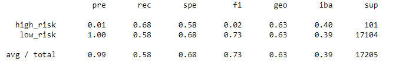

# Supervised Machine Learning
Personal lending is growing faster than credit card, auto, mortgage, and even student debt. With such incredible growth, 
FinTech firms are storming ahead of traditional loan processes. By using the latest machine learning techniques, 
these FinTech firms can continuously analyze large amounts of data and predict trends to optimize lending.

## Project Overview
In this project, Python has been used to build and evaluate several machine learning models to predict credit risk. 
Being able to predict credit risk with machine learning algorithms can help banks and financial institutions predict anomalies, 
reduce risk cases, monitor portfolios, and provide recommendations on what to do in cases of fraud.

## Tools and Techniques
Python, numpy, scikit-learn, tensorflow, logistic regression, decision tree, random forest, support vector machine algorithms, ensemble and resampling techniques 

## Summary of Analysis
Credit risk is an inherently unbalanced classification problem, as the number of good loans easily
  outnumber the number of risky loans. Therefore, we need to employ different techniques to train
  and evaluate models with unbalanced classes. The following techniques have been used in this analysis
  to access the credit risk, using data from LendingClub; a peer-to-peer lending services company.

## Oversampling the data using the RandomOverSampler and SMOTE algorithms.

### Naive Random Oversampling
### Classication Report

The accuracy score is 0.63 which means that the model is correct 63% of the time. From the imbalanced classification report, the precision is 1 for low-risk(majority class) and 0.01 for high-risk(minority class) loans which is not a good value to rely upon. The recall for high-risk loans is slightly better than the low-risk loans but F1 score is very poor for the high-risk loans. Hence, this model is not a good predictor to assess the credit risk.

### SMOTE Oversampling
### Classication Report

The accuracy score is 0.66 which means that the model is correct 66% of the time. From the imbalanced classification report, the precision is 1 for low-risk(majority class) and 0.01 for high-risk(minority class) loans which is not a good value to rely upon. The recall for high-risk loans is nearly equal to the low-risk loans but F1 score is very poor for the high-risk loans. Hence, this model is also not a good predictor to assess the credit risk.

As per the analysis, these Oversampling models  are not suitable for accessing the credit risk.
	

## Undersampling the data using the cluster centroids algorithm.
### Classication Report

The accuracy score is 0.53 which means that the model is correct 53% of the time. From the imbalanced classification report, the precision is 1 for low-risk(majority class) and 0.01 for high-risk(minority class) loans which is not a good value to rely upon. The recall for high-risk loans is greater than the low-risk loans but F1 score is very poor for the high-risk loans. Hence, this model is also not a good predictor to assess the credit risk.

As per the analysis, cluster centroids algorithm is also not suitable for accessing the 
	  credit risk.

## Use a Combination (Over and Under) Sampling approach with the SMOTEENN algorithm.
### Classication Report

The accuracy score is 0.65 which means that the model is correct 65% of the time. From the imbalanced classification report, the precision is 1 for low-risk(majority class) and 0.01 for high-risk(minority class) loans which is not a good value to rely upon. The recall for high-risk loans is greater than the low-risk loans but F1 score is still very poor for the high-risk loans. Hence, this model is also not a good predictor to assess the credit risk. But this model is better in terms of recall as compared to the above models. This model may be used if we give more weightage to the recall for high-risk loans.

This model is also not a good predictor to assess the credit risk. But this model is
	  better in terms of recall as compared to the above models. This model may be used if we give 
	  more weightage to the recall for high-risk loans.

## Ensemble classifiers i.e. "Balanced Random Forest Classifier" and "Easy Ensemble Classifier"
### Classication Report

Out of these two classifiers, in Easy Ensemble Classifier, the recall for both high-risk loans
	  and the low-risk loans is very high. Although F1 score is 0.16, but it is better than all the 
	  above models for the high-risk loans. Hence, this model may be used to assess the credit risk 
	  bit it is still not a good predictor. 